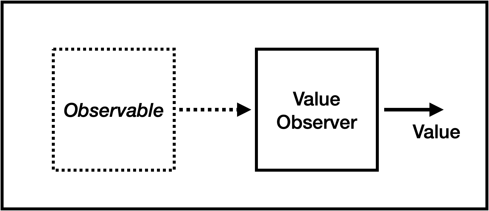

# The Control Framework API

The PCF API is a set of Python classes that can be used to build a Control component.

The framework is built around two key Python packages:

-  [Asyncio ](https://docs.python.org/3/library/asyncio.html) - which adds a set of asynchronous features  to Python, most significantly the ability to run multiple tasks.
-  [Aioreactive](https://github.com/dbrattli/aioreactive/tree/master) - a Python implememtation of [ReactiveX](https://reactivex.io)  (an API for asynchronous programming with observable streams)


The Framework comprises the following classes (so far):

- Conroller

- ControlProcess
- Value
- InputVariable
- OutputVariable
- ObservableValue
- ValueObserver


## Controller

A controller object is top-level of Control component. It 

- creates and manages the connection to the event-bus
- registers and starts the control processes

The contrioller class provides  the following API:

### API

#### Constructor

Create the controller and connect to the event-bus (default "localhost")

```python
Controller(eventbus = "localhost")
```


#### Register Process

Register a  process with the controller

```python
def register_process(self, process)
```

#### Start

Run the registered processes as asyncio tasks.

```python
async def start(self)
```


### Example

For example:

```python
controller = Controller()
controller.register_process(CIRCULATION_PUMP(controller))
controller.register_process(LIGHTING(controller))
await controller.start()
```


## Process

This is the abstract-base-class (ABC) for all control process  implementations: 

```python
class Process(ABC):
    """Base class for Control Process implementations """

    def __init__(self, controller):
        self.process = self.__class__.__name__
        self.controller = controller
        
    @abstractmethod
    async def run(self) -> None:
        """Run the process"""
        pass
```

It contains a constructure and a single function run() that must be implemented.

> [!IMPORTANT]
>
> The run() function must not exit, it should either wait on a data stream (as in the following example), or run in a loop with an asyncio delay to allow other tasks to run.

Example 

> [!NOTE]
>
> The Variable APIs are described below

```python
class CIRCULATION_PUMP(Process, ABC):
    async def run(self):
        i = InputVariable(self.controller, self.process, "STATE")
        o = OutputVariable(self.controller,  self.process, "CIRCULATION")
        await i.subscribe_async(o)
```


## Value

The core data type used by the variables is Value :

### API

#### Constructor

Takes the following parameters:

- value - an integer, float, boolean or None value
- timestamp - integer value. Milliseconds since the epoch.. If not supplied the current time is used.

```python
Value(value, timestamp = int(time.time()))
```


## Input Variable

InputVariable is a Observable wrapper to an event-bus subscription. 


It is an AsyncObservable of type Value.

```python
InputVariable(controller, process_id, variable_id)
```

The constructor takes the process_id and variable_id and creates an event bus subscription for the variable, thereafter changes the value of the variable will be delivered to any observers subscribed to it.

```python
async def subscribe_async(self, observer)
```

See the example above.

## Output Variable

OutputVariable is an Observer wrapper for an event bus publisher. 


It is an AsyncObserver of type Value

```python
OutputVariable(controller, process_id, variable_id)
```

The constructor takes the process_id and variable_id and creates the event bus subject  for the variable, Thereafter all changes to the value will be published to this sujbect on the event bus.

See the example above.


## Observable Value

ObservableValue is a very simple  AsyncObservable of type Value. Setting the value triggers an event which is delivered to the subscribed observer(s). 


```
ObservableValue()
```

The initial value is None

```python
async def set_value(self, value)
```

The set_value() function triggers the observable with the given value.


## Value Observer

A ValueObserver is a very simple Asynchronous Observer of type Value that keeps the latest value it observed.



```
ValueObserver()
```

The initial value in None.


