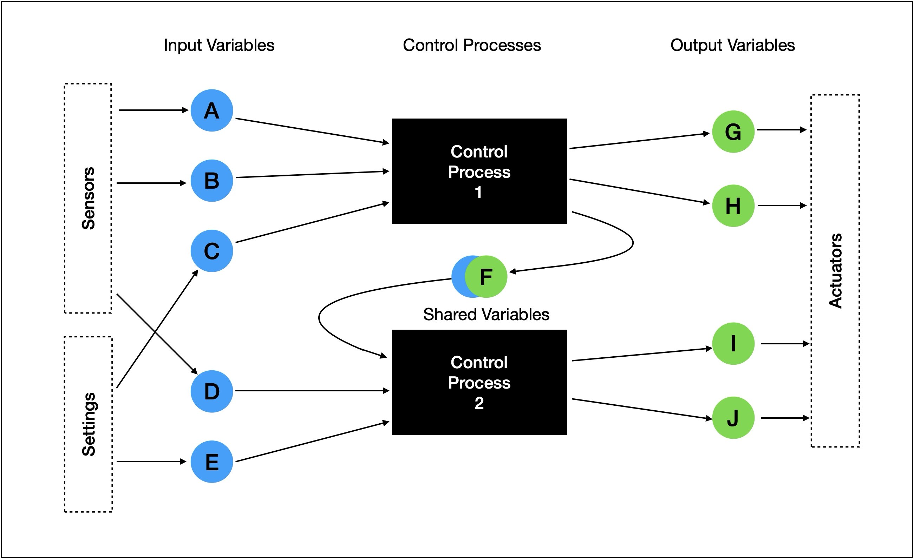

# Control Model

### Concept

The process congtrol model is a very simple abstration that allows a wide variety of control mechanisms to be implemented.

The most basic task of process control is to take some input values, perform an operation or calculation on them, and create some outut values.

The process-control-model abstracts the problem into:

- Input Values
- Control Processes
- Output Variables

A Control Process takes a set of inputs, performs its operation and creates output. There can be more that one Control Process in the model, and outputs of one control process can provide inputs ro another through **Shared Variables**.

The following diagram shows these core elements of the model.




## Variables

### Input Variables

### Output Variables


## Event-bus Subjects

As described above a process control component inderfaces with the outside world using variables, so to enable this iterfacing to occur over the event bus variables are exposed as subjects.

Input Variables are published on:

```xml
pc.invar.<PROCESS_ID>.<VARIABLE_ID>
```

Output Variables are published on:

```xml
pc.outvar.<PROCESS_ID>.<VARIABLE_ID>
```

> [!NOTE]
>
> Shared variables are purely interal to a process-control component and are not published


