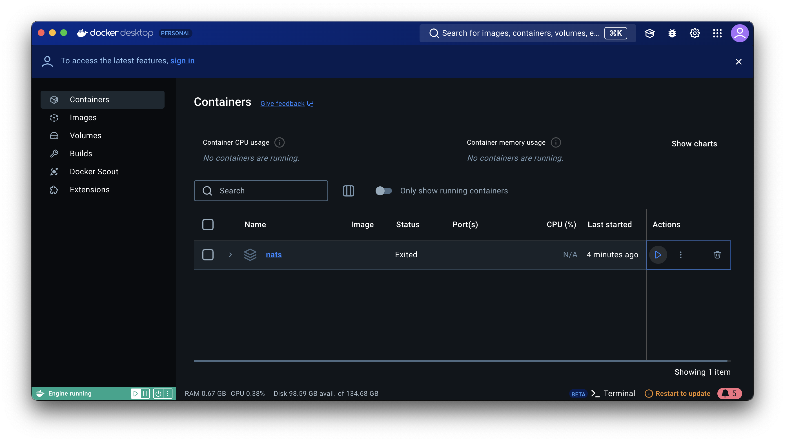

# Developing and Testing


To be completed.

## Installing Nats using Docker

To be able to develop and test Greenglass-Project components requires a running Nats server.

The recommending way to run this is using docker.

First instal the  [docker desktop app](https://www.docker.com) on your machine.

Then create a docker-compose.yaml  file in the directory that you want to run the server from.

Use the following contents for Mac/Linux

```yaml
services:
  nats:
    image: nats:alpine
    hostname: nats
    container_name: nats
    restart: always
    ports:
      - "4222:4222"
      - "8222:8222"

```

and this for Windows

```yaml
services:
  nats:
    image: nats:nanoserver-1809
    hostname: nats
    container_name: nats
    restart: always
    ports:
      - "4222:4222"
      - "8222:8222"
```

The docker-compose file must be run manually the first time. Afterwards it can be controlled through docker desktop.

Go to the directory containing the file and from the command prompt enter:

```
docker compose up
```

This will start a nats container and it will appear in the desktop's dashboard.



It can be started and stopped using the 'actions' on the right.

