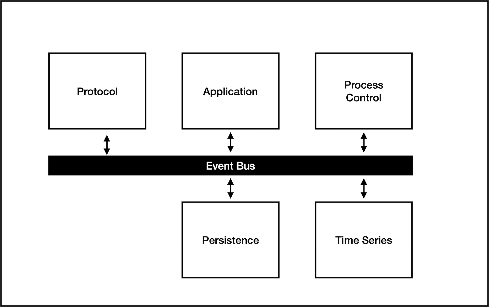

# The Greenglass Project

## Concept


To be completed.......


## Host Architecture

The Greenglass Project modular host architecture allows Iot host systems to be constructed using a set of loosley coupled components, which are glued together using a publish-and-subscribe based event bus



Typical components are:

### Protocol Components

These implement the protocols use to communicate with the edge devices, for example:

- Eclipse Sparkplug for LAN-based systems
- LwM2M for WAN-based systems

A host implementation can have more than one protocol component.

### Application Component

A host implementation will have one application component that orchestrates the operation of the system. This includes controlling and monitoring the system, and providing an interface to be used by the UI.

### Process Control

A Process Control component implemets the application's process control model,

### Persistence

A  Persistence  component manages the system's  persistent data model 

### Time Series

A component that stores raw time-series data and provides tools for its analysis.


## The Event Bus

The Greenglass Project event-bus is based around the  [Nats messaging platform](https://nats.io)

Nats provides many different services, however the Event Bus primarily uses its  [publish-and-subscribe ](https://docs.nats.io/nats-concepts/subjects)functionality. 

> From nats.io
>
> NATS is a system for publishing and listening for messages on named communication channels we call `Subjects`. Fundamentally, NATS is an `interest-based` messaging system, where the listener has to `subscribe` to a subset of `subjects`.


The Event Bus concept allows a loosly coupled set of components that communicate using predefined subjects and messages.

By convention subjects begin with a name idenifying a subsystem, followed by a set of names that identify some specific functionality.

An example of this would be process control messages:

```
pc.invar.TEMP_CONTROL.TEMP
```

Where

- `pc` - is the Process Control component
- `invar` - an input variable
- `TEMP_CONTROL` - is the process-id
- `TEMP` - is the variable-id

See section xxx for details of this,

